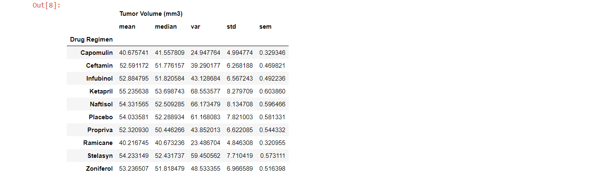
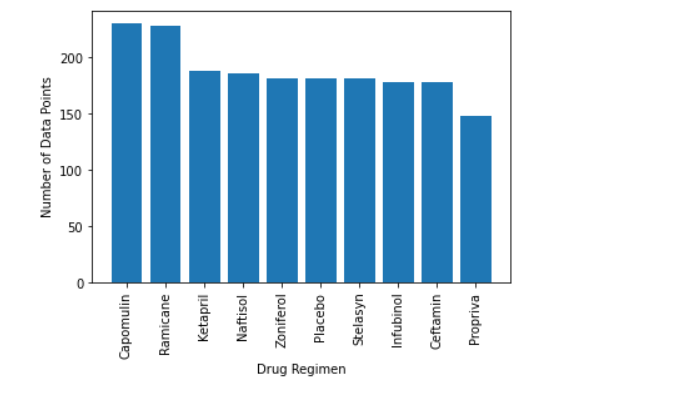
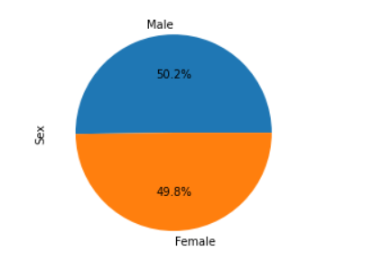
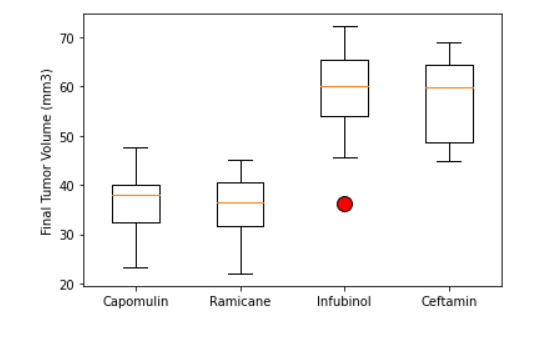
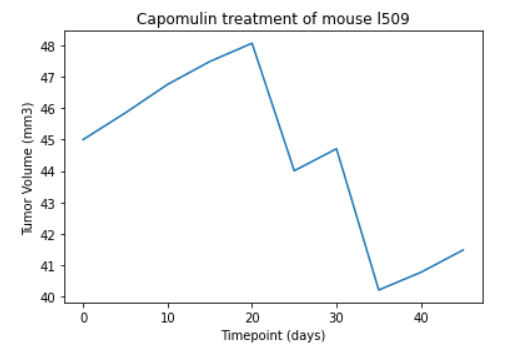
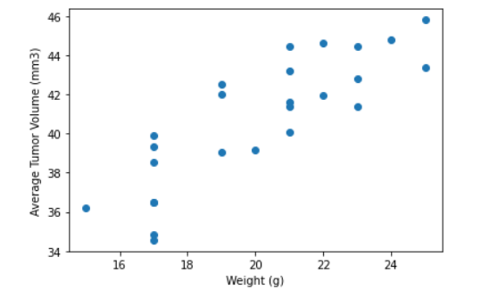

# Pymaceuticals Reports with Matplotlib

As a data analyst at the company (Pymaceuticals Inc.) dedicated to create distinct types of drugs for treatments of cancer, we've been given access to the complete data from their most recent animal study. In this study, 250 mice identified with SCC tumor growth were treated through a variety of drug regimens. Over the course of 45 days, tumor development was observed and measured. The purpose of this study was to compare the performance of Pymaceuticals' drug of interest, Capomulin, versus the other treatment regimens. In this project was necessary by the executive team to generate all the tables and figures needed for the technical report of the study. Also was asked for a top-level summary of the study results.

The tasks performed: 
-  A summary statistics table consisting of the mean, median, variance, standard deviation, and SEM of the tumor volume for each drug regimen.

- A bar plot using both Pandas's DataFrame.plot() and Matplotlib's pyplot that shows the number of data points for each treatment regimen.

- A pie plot using both Pandas's DataFrame.plot() and Matplotlib's pyplot that shows the distribution of female or male mice in the study.

- Using Matplotlib, generate a box and whisker plot of the final tumor volume for all four treatment regimens and highlight any potential outliers in the plot by changing their color and style.

- Generate a line plot of time point versus tumor volume for a single mouse treated with Capomulin.

- Generate a scatter plot of mouse weight versus average tumor volume for the Capomulin treatment regimen.

- Calculate the correlation coefficient and linear regression model between mouse weight and average tumor volume for the Capomulin treatment. Plot the linear regression model on top of the previous scatter plot.

